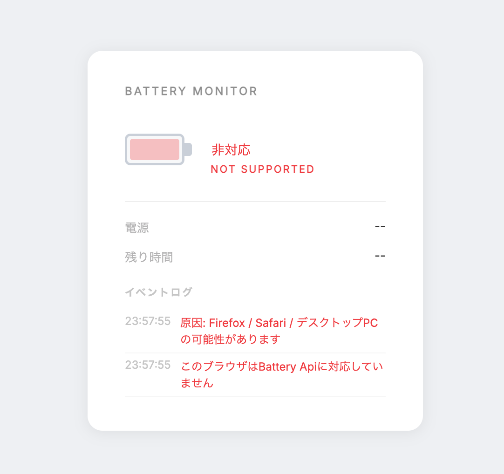

# Battery-Monitor
### Battery Monitor Tool: When you plug your charger into your PC, it shows your current battery level, how much time you’ve got left, event logs, when the charger was connected, and power usage. If your browser or device isn’t supported, it’ll show a proper warning.

## 🔌 Before Charging

## ⚡ Charging

## 🔋 After Charging

## ⚠️ Browser isn’t supported

